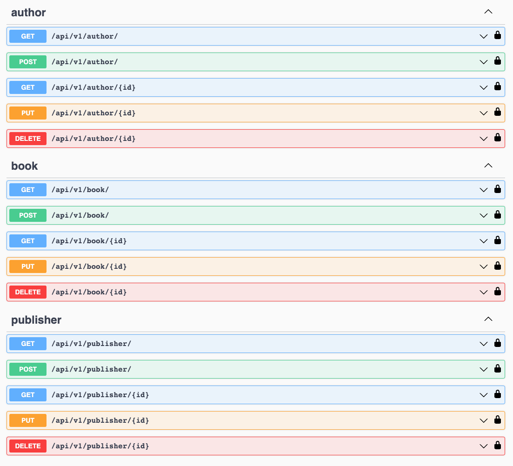

# Simple CRUD with Django and Peewee ORM

### Installation:

```
make install
```
### Run:

```
make run
```
### Run Tests:

```
make test
```
<div align="center">


</div>

### Features

| Feature |
| ------ |
| Django |
| Pagination |
| Auto Swagger |
| API Versioning |
| Pre-commit Checks |
